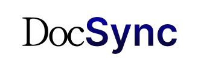

<!-- PROJECT SHIELDS -->
[![Contributors][contributors-shield]][contributors-url]
[![Forks][forks-shield]][forks-url]
[![Stargazers][stars-shield]][stars-url]
[![Issues][issues-shield]][issues-url]
[![project_license][license-shield]][license-url]
[![LinkedIn][linkedin-shield]][linkedin-url]

<!-- PROJECT LOGO -->
<br />
<div align="center">
  <a href="https://github.com/joaohall/docsync">
    
  </a>

<h3 align="center">DocSync 🩺✨</h3>

  <p align="center">
    Aplicativo inteligente para gerenciamento médico de consultas, ajudando pacientes e profissionais de saúde a organizar compromissos de forma eficiente.
    <br />
    <a href="https://github.com/joaohall/docsync"><strong>Explore a documentação »</strong></a>
    <br />
    <br />
    <a href="https://github.com/joaohall/docsync">Ver Demo</a>
    &middot;
    <a href="https://github.com/joaohall/docsync/issues/new?labels=bug&template=bug-report---.md">Reportar Bug</a>
    &middot;
    <a href="https://github.com/joaohall/docsync/issues/new?labels=enhancement&template=feature-request---.md">Solicitar Feature</a>
  </p>
</div>

---

## 📖 Sobre o Projeto

[![Product Name Screen Shot][product-screenshot]](https://example.com)

O **DocSync** é uma aplicação full stack voltada para o gerenciamento médico de consultas.  
Seu objetivo é simplificar a vida de pacientes e profissionais de saúde, organizando compromissos, oferecendo agendamento inteligente e garantindo uma experiência moderna e intuitiva.

---

### 🛠️ Construído com

* [![Next][Next.js]][Next-url]
* [![React][React.js]][React-url]
* [Prisma ORM](https://www.prisma.io/)
* [MongoDB](https://www.mongodb.com/)
* [Jest](https://jestjs.io/)
* [tRPC](https://trpc.io/)
* [Framer Motion](https://www.framer.com/motion/)
* [Redux](https://redux.js.org/)
* [Axios](https://axios-http.com/)

---

## 🚀 Getting Started

### ✅ Pré-requisitos

* Node.js & npm
  ```sh
  npm install npm@latest -g
  ```
* MongoDB rodando localmente ou via Atlas  
* Variáveis de ambiente configuradas (`.env`)

### ⚡ Instalação

1. Clone o repositório:
   ```sh
   git clone https://github.com/joaohall/docsync.git
   ```
2. Instale as dependências:
   ```sh
   npm install
   ```
3. Configure o banco de dados (MongoDB + Prisma):
   ```sh
   npx prisma migrate dev
   ```
4. Rode o projeto:
   ```sh
   npm run dev
   ```

---

## 💻 Uso

Após rodar o projeto, acesse:

```sh
http://localhost:3000
```

Você pode se registrar como  **profissional de saúde** e começar a gerenciar suas consultas.

---

## 🛣️ Roadmap

- [X] Autenticação AWT
- [X] Integração com calendário externo
- [ ] Chat com os pacientes via whatsapp
- [ ] Notificações por e-mail
- [X] Dashboard com métricas para profissionais de saúde

Veja os [issues abertos](https://github.com/joaohall/docsync/issues) para mais ideias e bugs conhecidos.

---

## 🤝 Contribuindo

Contribuições são sempre bem-vindas!  

1. Fork o projeto
2. Crie sua Feature Branch (`git checkout -b feature/NovaFeature`)
3. Commit suas mudanças (`git commit -m 'Adiciona nova feature'`)
4. Push para a Branch (`git push origin feature/NovaFeature`)
5. Abra um Pull Request

<a href="https://github.com/joaohall/docsync/graphs/contributors">
  
</a>

---

## 📜 Licença

Distribuído sob a licença MIT. Veja `LICENSE.txt` para mais informações.

---

## 📬 Contato

João Hall - joao.edu.hall@gmail.com  

Link do Projeto: [https://github.com/joaohall/docsync](https://github.com/gjoaohall/docsync)

---

## 🙌 Agradecimentos

* [Prisma ORM](https://www.prisma.io/)
* [Next.js Docs](https://nextjs.org/docs)
* [MongoDB University](https://learn.mongodb.com/)
* [Framer Motion](https://www.framer.com/motion/)

---

<!-- MARKDOWN LINKS & IMAGES -->
[contributors-shield]: https://img.shields.io/github/contributors/joaohall/docsync.svg?style=for-the-badge
[contributors-url]: https://github.com/joaohall/docsync/graphs/contributors
[forks-shield]: https://img.shields.io/github/forks/joaohall/docsync.svg?style=for-the-badge
[forks-url]: https://github.com/joaohall/docsync/network/members
[stars-shield]: https://img.shields.io/github/stars/joaohall/docsync.svg?style=for-the-badge
[stars-url]: https://github.com/joaohall/docsync/stargazers
[issues-shield]: https://img.shields.io/github/issues/joaohall/docsync.svg?style=for-the-badge
[issues-url]: https://github.com/joaohall/docsync/issues
[license-shield]: https://img.shields.io/github/license/joaohall/docsync.svg?style=for-the-badge
[license-url]: https://github.com/joaohall/docsync/blob/master/LICENSE.txt
[linkedin-shield]: https://img.shields.io/badge/-LinkedIn-black.svg?style=for-the-badge&logo=linkedin&colorB=555
[linkedin-url]: https://linkedin.com/in/linkedin_username
[product-screenshot]: images/preview.png
[Next.js]: https://img.shields.io/badge/next.js-000000?style=for-the-badge&logo=nextdotjs&logoColor=white
[Next-url]: https://nextjs.org/
[React.js]: https://img.shields.io/badge/React-20232A?style=for-the-badge&logo=react&logoColor=61DAFB
[React-url]: https://reactjs.org/
